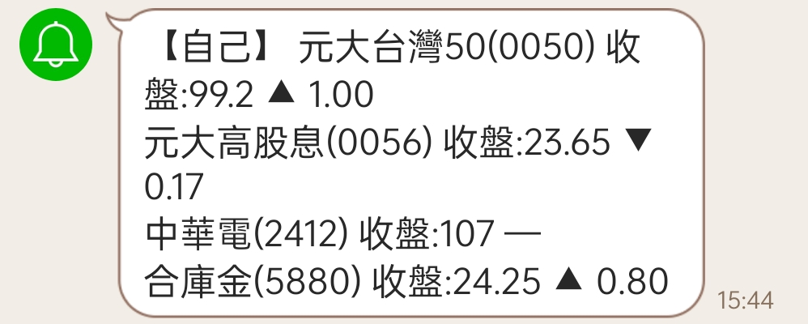

# Line Notify Demo for GAS (Google Apps Script)

## 紀錄一下開發過程

1. 初始化專案
1. 改設定
1. 加上log,讓前/後端都可以紀錄log
1. 加上儲存/讀取line通知的token功能
1. 加上傳送line的通知功能
1. 修改界面
1. 修正彈跳視窗方式與動畫

### 1. 初始化專案與第一次部屬

1. 拷貝 template

   `git clone https://github.com/Mirochiu/React-Google-Apps-Script.git`

1. 登入

   登入clasp,已有本機登入者請略過
   `npm run login`

1. 第一次部屬

  `npm run setup`
  `npm run deploy`

  deploy後會顯示2個網址
  1. 第一個是Sheet的網址
  1. 第二個是Apps Script的網址,也就是這script的那個
     `Created new Google Sheets Add-on script ....`
     網址會像 `https://script.google.com/home/projects/18F.....eT/edit`

  點擊右上角的部屬→選"新增部屬作業"
  1. 左上齒輪→選取類型→選"網頁應用程式"
  1. 右邊→誰可以存取→改"所有人"
  1. 右下方→部屬按鈕
  1. 點擊→授予存取權

  之後的過程
  1. 彈出google登入→選擇登入你的帳號
  1. 彈出→"Google hasn’t verified this app"→點擊左下的小字"Advanced"→點擊下面小字"Go to My React Project (unsafe)"
  1. 彈出→"My React Project wants to access your Google Account"→點擊"Allow"
  1. 顯示→網頁應用程式→這裡會顯示你的{部屬ID}→這裡會顯示取得{你的Webapp網址}→點擊"完成"

  - 部屬ID會類似: `AKf.....YoKA`
  - 部屬網址會是對應的: `https://script.google.com/macros/s/AKf.....YoKA/exec`

   為了不讓網址一直改,所以我們要使用同一個{部屬ID}

### 2. 使用第一次獲得的部屬ID修改

開啟package.json把你的{部屬ID}放到script裡頭

在script底下的deploy

- 從本來的

   `"deploy": "rimraf dist && npm run build && npx clasp push",`

- 改成

   `"deploy": "rimraf dist && npm run build && npx clasp push && npx clasp deploy --deploymentId {部屬ID}",`

然後在上面新增一個指令

`"web": "npx clasp open --webapp --deploymentId {部屬ID}",`

(本Repo已經調整過,是把部屬ID寫到`.clasp.json`裡頭的deployId)

修改`appsscript.json`, 加上webapp的設定
```json
  "webapp": {
    "executeAs": "USER_DEPLOYING",
    "access": "ANYONE_ANONYMOUS"
  }
```

若沒有加入webapp設定,會顯示成下面這樣


- 發布版本

   `npm run deploy`

- 查看網頁

   `npm run web`

- 本機界面測試

   `npm run serve`

- 遠端界面測試

   `npm run start`

### 3. 使用按鈕寫入log

1. 新增工作表

    先在google sheet那邊新增工作表並改名'紀錄檔'

2. 改server新增一個log函數

    在server裡頭開新的函數,就叫做log,新增在`src/server/sheets.js`最下面

    ```javascript
    export const log = (...args) => {
      const s = SpreadsheetApp.getActive().getSheetByName('紀錄檔')
      s.appendRow(Array.prototype.concat(new Date(), args));
    }
    ```

    log函數解釋:宣告一個function叫做log,並匯出;從SpreadsheetApp取得綁定的試算表,再用getSheetByName抓出工作表'紀錄檔',然後插入一列,內容是先紀錄下當下時間,後面接著列出送給log函數的所有參數

3. 開放log函數給client使用

    函數開好之後要對client端開放,所以改`src/server.index.ts`檔案

    請在import後面加上函數名稱log,然後在後面的export中也加上log
    ```javascript
    import { getSheetsData, addSheet, deleteSheet, setActiveSheet, log } from './sheets';
    ...
    export {
    ...
      log,
    };
    ```
    這個動作的解釋:因為每個檔案是被當作一個模組看待,所以需要先從sheet模組匯入log函數,再匯出給client才能在網頁裡頭使用。

4. 改client網頁

    在client端網頁有個按鈕,按了之後會顯示url,我們現在想在按了按鈕的時候寫入log

    `src/client/demo-bootstrap/components/App.jsx`

    因為按按鈕會改`showBtn`這個state,所以我們用`React.useEffect`去關注這個state的變化

    ```jsx
      const onShowUrlChanged = () => {
        if (showUrl) {
          console.log('clicked');
          serverFunctions.log('clicked');
        }
      }

      React.useEffect(onShowUrlChanged, [showUrl]);
    ```

    動作解釋:我們用`React.useEffect`註冊關注變化的函數onShowUrlChanged,並在關注陣列中寫上showUrl,這樣react就會在state內容改變時通知onShowUrlChanged;而我們想要當使用者按下按鈕時紀錄一下,要用if判斷showUrl是否為true(showUrl初始化沒有給值,預設為null)

    *`React.useEffect`如果簡寫成useEffect,就需要在檔案前頭作import的動作*

    在sheet的工作表'紀錄檔',就會看到使用者按下顯示url時的log,時間,以及文字
    

### 4. 加上儲存/讀取line通知的token功能(未完待續)
### 5. 加上傳送line的通知功能(未完待續)
### 6. 修改界面(未完待續)
### 7. 修正彈跳視窗方式與動畫(未完待續)

## 製作股票收盤自動LINE通知

#### 新增觸發處理函數並設定時間觸發條件

先寫上觸發用的函數onTriggered,我們直接把onTriggered接上log
`src/server/trigger.js`
```javascript
import { log } from './sheets';
const onTriggered = log;
export { onTriggered };
```

在server加上對client開放的程式碼

`src/server/index.ts`
```javascript
import { onTriggered } from './trigger';
...
export {
...
  onTriggered,
};
```

自行開啟Apps Script網頁的專案界面>左邊選單"觸發條件">右下角"新增觸發條件">彈跳出"新增「Gas Line Notify Demo」觸發條件"的功能選單

放置個10來分鐘,去開啟sheet名為紀錄檔"的工作表,可以看到有資料進來

`2022/10/4 下午 1:29:21	{month=10.0, week-of-year=40.0, hour=5.0, year=2022.0, authMode=FULL, second=20.0, day-of-month=4.0, minute=29.0, day-of-week=2.0, timezone=UTC, triggerUid=12925279}
`

| 欄位名 | 意義 |
| -------- | :-------: |
|authMode	| 授權模式 |
| triggerUid | 哪個觸發的 |
| week-of-year | 第幾週 |
| timezone | 時區 **(要使用)** |
| year | 幾年(西元) |
| month | 幾月(1月給1) |
| day-of-month | 幾日(1號給1) |
| day-of-week | 星期幾(週2就給2,週日給7) **(要使用)** |
| hour | 幾點 **(要使用)** |
| minute | 幾分 |
| second | 幾秒 |

上表資料參考[官方文件](https://developers.google.com/apps-script/guides/triggers/events)

可以看到時區不是我們所在時區,所以小時也不正確,所以我們需要調整Apps Script的時區

雖然我們可以由Apps Script專案頁面中調整時區，但是因為我們是透過clasp管理所以deploy上去的時候也會被覆蓋掉,所以正確的修改時區方法是改`appsscript.json`

把原本的
`"timeZone": "America/New_York",`
改成
`"timeZone": "Asia/Taipei",`

原本是自己寫UTC轉UTC+8,2022/10/11改成`event2date`這個函數使用`Date.UTC`處理

```javascript
const event2date = (e) => {
  let date = new Date(Date.UTC(
    e.year, e.month-1, e['day-of-month'],
    e.hour, e.minute, e.second
  ));
  return {
    date,
    event: e,
    hour: date.getHours(),
    wday: date.getDay() == 0 ? 7 : date.getDay(),
    year: date.getFullYear(),
    month: date.getMonth() + 1,
    day: date.getDate(),
  };
}
```
上面這個trigger2obj函數的動作解釋:從e取出date需要的資料;因為從先前調整測試得知Apps Script的觸發都是給UTC時間,不過在月份跟星期的部份,因為定義不同需要調整一下

#### 取用開放資料

然後網路上有政府有開放上市股票開盤/收盤的資料
`https://data.gov.tw/dataset/11549`

底下說有個說明文件"OAS標準之API說明文件網址 `https://openapi.twse.com.tw/v1/swagger.json`"
開起來對一般人來說會是亂碼,實際上他是可用Swagger開啟的說明文檔

從Swagger官方的[swagger-ui](https://swagger.io/tools/swagger-ui/)進去點`Live Demo`的按鈕，在上方欄內填入OAS標準之API說明文件網址
`https://openapi.twse.com.tw/v1/swagger.json`

不過跟我這裡要使用的資料一點關係都沒有(吐嘈:那幹麻還寫在上面...)

我們要用的是csv的資料檔
內容是下圖這樣


| 欄位名稱 | 欄位idx | 意義 |
| --- | :---: | :---: |
| 證券代號 | 0 | 就是常說的股票號碼 |
| 證券名稱 | 1 | 公司的股票名稱 |
| 開盤價 | 4 | 開盤的第一筆撮合的成交價 |
| 收盤價 | 7 | 收盤最後完成撮合的成交價 |

就寫成了fetchAndFilterStockByNumber函數
```javascript
const fetchAndFilterStockByNumber = (list) => {
  const res = UrlFetchApp
    .fetch('https://www.twse.com.tw/exchangeReport/STOCK_DAY_ALL?response=open_data');
  return Utilities
    .parseCsv(res.getContentText())
    .filter(r => list.includes(r[0]))
    .map(r => ({
      id:r[0],
      name:r[1],
      openPrice: parseFloat(r[4]),
      closePrice: parseFloat(r[7]),
    }));
}
```

上面這個fetchAndFilterStockByNumber函數的動作解釋:使用Apps Script的`UrlFetchApp.fetch`服務可以幫我們抓取遠端伺服器的回應資料,不過有限制資料類型以及對方伺服器需要有允許跨佔存取,因為開放資料有允許所以我們就可以直接用;接著我們使用提供的`Utilities.parseCsv`工具將回應的csv文字檔案(`res.getContentText()`)轉成程式可讀的形式,也就是陣列形式;再透過filter作過濾,map轉換成人可閱讀的物件陣列
*2022-10-20* 新增處理Price轉換成Number類型

#### 讀取設定並發送Line通知

我們使用前面開發好的notify和getConfig就能夠將我們想要查的股票資訊透過Line通知送給我們自己。這裡設定wday星期一到星期五,14點的時候可以發送通知

```javascript
import { getConfig, log } from './sheets';
import { notify } from './line';

const onTriggered = (event) => {
  const runAt = trigger2obj(event);
  try {
    if (runAt.wday>=6 || runAt.hour!=14) return;
    const concerned = getConfig('ConcernedStocks').split(',');
    const filtered = fetchAndFilterStockByNumber(concerned);
    if (filtered.length !== concerned.length) {
      log(`過濾後資料數量不吻合 f:${filtered.length} !== ${concerned.length} l:${concerned.join(',')}`);
    }
    const priceComp = (c, o) => {
      if (c > o) return `▲ ${(c - o).toFixed(2)}`;
      if (o > c) return `▼ ${(o - c).toFixed(2)}`;
      return '—';
    };
    const msg = filtered
      .map(r => `${r.name}(${r.id}) 收盤:${r.closePrice} ${priceComp(r.closePrice, r.openPrice)}`)
      .join('\n');
    log(msg);
    notify(msg);
  }
  catch (e) {
    log('發生錯誤', e);
  }
}
```

onTriggered的動作解釋:onTriggered會收到Apps Script發送的event資料,我們檢驗觸發時間,如果是定好的時間,就取出我們設定好的股票號碼列表,以逗號`,`分隔,例如0050,0056;透過fetchAndFilterStockByNumber幫我們取回資料,並依照前面的號碼列表過濾所需的收盤價;然後把資料組成我們人可以看懂的訊息:'公司名1(股票號碼1) 收盤:YY.YY 漲跌幅\n公司名2(股票號碼2) 收盤:YY.YY 漲跌幅\n...',然後透過notify將這個訊息用發送到個人的Line Notify

收到的Line訊息會類似下圖這樣


**這裡要注意的是** 我們需要在工作表'設定檔'將ConcernedStocks的val欄位設定格式為'純文字',不然設定股票號碼時,所輸入資料可能會自動跑去數字格式,導致onTriggered處理發生錯誤,或是找不到股票號碼的問題


#### 2022-10新增:檢查是否為休假日

我們同樣使用open data API存取休假日,可透過fetchHoliday取回休息日,因為休息日是以民國年月日方式呈現yyymmdd,為了要和date比較所以要作一些處理

```javascript
const fetchHoliday = () => {
  const res = UrlFetchApp
    .fetch('https://www.twse.com.tw/holidaySchedule/holidaySchedule?response=open_data');
  return Utilities.parseCsv(res.getContentText())
    .shift() // 移除欄位名稱的那一列
    .map(r => ({
      name: r[0],
      //CSV檔案內的格式是民國年月日=>XXXYYZZ
      date: new Date(
        1911 + parseInt(r[1].substring(0, 3)),
        parseInt(r[1].substring(3, 5)) - 1, // 因為Date的month是從0開始,而不是1月的1開始
        parseInt(r[1].substring(5)),
      ),
      wday: r[2],
      comments: r[3],
    }));
}
```

這樣在主邏輯部份就能夠作簡單比較
```javascript
const runAt = event2date(event);
if (runAt.wday >= 6 || runAt.hour != 14) return;

const holiday = fetchHoliday();
if (Array.isArray(holiday)) {
  const matchHoliday = holiday.find(({ date }) =>
    date.getDate() === runAt.date.getDate()
    && date.getMonth() === runAt.date.getMonth()
    && date.getFullYear() === runAt.date.getFullYear()
  );
  if (matchHoliday) {
    log('今天是股票休假日', matchHoliday, runAt);
    return;
  }
}
else {
  log(`無法取得休息日資訊`);
  notify('無法取得休息日資訊');
  //仍繼續執行
}
```

#### 2022-10-20新增:從編輯器UI測試觸發時略過檢查時間機制

因為編輯器UI去執行時不會給予參數event所以就只能略過時間檢查機制

```javascript
const onTriggered = (event) => {
  try {
    //for test or trigger from editor
    if (event === undefined) {
      log('施行觸發測試中...');
      notify('施行觸發測試中...');
    }
    else {
      const runAt = event2date(event);
```
